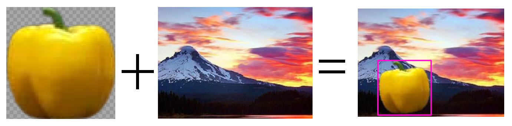

# Auto-Label Toolkit for YOLO Object Detection

Create data in Yolo8 format fast and efficiently using automatic labelling.

Requires Python 3.10. To run on GPU install torch CUDA.

<p align="center">
  
</p>

A toolkit for labelling data manually and automatically by training models on smaller datasets.


## Environment set up
First open command prompt and cd to whereever you have installed the AutoLabelToolkit
```bash
cd your/directory/yolo_object_detection
```
Create a new envirnment (call it yolo_env or whatever you want):
```bash
python -m venv yolo_env
```
Install the packages:
```bash
pip install -r requirements.txt
```

You may need to install CUDA seperately from [here](https://pytorch.org/).


## Create datasets

Lets say we have a dataset of images. First lets create a smaller dataset of that which we will use to train our starting models.

make sure these datasets are saved into __data/unlabeled__, we will use images of fruit for our example (datasets provided for reference).

<p align="center">
  
</p>

To manually label fruit_small, make sure the right folder is set in src/config.yaml
```
unlabeled_folder: "fruit_small"
```

Also define the classes and associated bbox color.

Now cd into src `cd src` and we are all set to manually label:

```bash
python label_images.py 
```

<p align="center">
  
</p>
<p align="center">
  
</p>


When this is finished, you'll see a folder has been created in data/labeled with the same name as the unlabelled folder
```
...
Saved labels for img_68_png.rf.1043f89c31fa775c9f377f0e8b358544.jpg
Image and labels saved in train folder.
Generated YOLO YAML file at D:\yolo_object_detection\src\..\data\labeled\fruit_small\data.yaml
```

## Train Small Model

Now lets train a model on our small labelled dataset, model name can be specified in config.yaml:
```
model: "steve"
```
Now we train the model:

```bash
python train.py --epochs 20 --batch_size 32
```

```
Epoch    GPU_mem   box_loss   cls_loss   dfl_loss  Instances       Size
1/20       3.2G      1.079      5.052      1.134         89        320: 100%|██████████| 10/10 [
            Class     Images  Instances      Box(P          R      mAP50  mAP50-95): 100%|████████
            all        141        152       0.41      0.431      0.256      0.216

Epoch    GPU_mem   box_loss   cls_loss   dfl_loss  Instances       Size
2/20      3.27G     0.6795      1.945     0.9993         92        320: 100%|██████████| 10/10 [
            Class     Images  Instances      Box(P          R      mAP50  mAP50-95): 100%|████████
            all        141        152      0.584      0.768      0.724      0.628

Epoch    GPU_mem   box_loss   cls_loss   dfl_loss  Instances       Size
3/20      3.22G     0.5641      0.934     0.9246         86        320: 100%|██████████| 10/10 [
            Class     Images  Instances      Box(P          R      mAP50  mAP50-95): 100%|████████
            all        141        152      0.912      0.905      0.973      0.864

...

20 epochs completed in 0.012 hours.
Optimizer stripped from runs\detect\steven\weights\last.pt, 22.5MB
Optimizer stripped from runs\detect\steven\weights\best.pt, 22.5MB

Validating runs\detect\steven\weights\best.pt...
Ultralytics YOLOv8.2.93 🚀 Python-3.12.7 torch-2.4.1+cu124 CUDA:0 (NVIDIA GeForce RTX 4070, 12282MiB)
Model summary (fused): 168 layers, 11,128,680 parameters, 0 gradients, 28.5 GFLOPs
                 Class     Images  Instances      Box(P          R      mAP50  mAP50-95): 100%|████████
                   all        141        152      0.984      0.997      0.992      0.915
              capsicum         18         18      0.984          1      0.995      0.952
                garlic         21         21          1       0.98      0.995      0.927
                 lemon         17         17      0.981          1      0.995      0.905
                  lime         17         17      0.999          1      0.995      0.892
                  pear         23         23      0.949          1      0.973      0.891
                potato         23         23      0.987          1      0.995      0.925
               pumpkin         15         15      0.983          1      0.995      0.917
                tomato         18         18      0.988          1      0.995      0.909
Speed: 0.0ms preprocess, 0.4ms inference, 0.0ms loss, 0.4ms postprocess per image
Results saved to runs\detect\steven
Saved in: runs\detect\steven
```

## Auto Label

Now its time to label the larger dataset with our new model.
First specify the name of the dataset in config.yaml

```
unlabeled_folder: "fruit_large"
```
Now we run auto label:

```bash
python auto_label.py
```

```
...
Saved image to: D:\yolo_object_detection\data\labeled\fruit_large\test\images\Bellpepper4_30cm_png.rf.3479e381d131b92a19ef39247bf7a130.jpg
Saved labels to: D:\yolo_object_detection\data\labeled\fruit_large\test\labels\Bellpepper4_30cm_png.rf.3479e381d131b92a19ef39247bf7a130.txt
...
```

You will notice the a new folder has been created in data/labeled.

To simply view the labeled dataset we can run the following:

```bash
python examine_labeled_data.py
```
<p align="center">
  
</p>

Space bar will cycle through the data. But as expected we have some errors, it has labelled a potato as a pumpkin:

<p align="center">
  
</p>

Therefore we should run label_images.py again to confirm / reject images.

```bash
python python label_images.py 
```
Images will be __Confirmed__ by default. 

Cycle through images with __n__.

Press __esc__ to remove any incorrect bounding boxes and then redraw manually.

<p align="center">
  
</p>

# Conclusion

And there we have it. Once this dataset has been fully labelled, we can train another model off the larger dataset. 

Yay :D

Bellow is some more functionality offered by this toolkit:


## Generate Random Data
This toolbox also allows us to generate random data using random backgrounds, with images of the object of interest with transparents backgrounds.

Therefore we can generate random data samples.

<p align="center">
  
</p>

First we put pictures of the objects of interest with transparent background in the folder `src/generate_random_data/objects`. Note that the file name will matter here, as the script will label the images as it goes. E.g. name the photo 'labelName[Number]' as in 'capsicum1'.

Next put a bunch of random images for backgrounds in the folder `src/generate_random_data/fruits`.

In the `Config.yaml` file, specify the `name_of_created_dataset` and `repeats_per_object` which will specify the amount of images that will be created per object / background pair (it will randomly rotate and position the object).

Now cd into `src/generate_random_data` and run:
```python
python generate_random_images.py
```
It will output:
```
92.64% - Processed tomato19.png
93.07% - Processed tomato2.png
93.51% - Processed tomato20.png
93.94% - Processed tomato21.png
94.37% - Processed tomato22.png
94.81% - Processed tomato23.png
95.24% - Processed tomato24.png
95.67% - Processed tomato25.png
96.10% - Processed tomato26.png
96.54% - Processed tomato27.png
96.97% - Processed tomato28.png
97.40% - Processed tomato3.png
97.84% - Processed tomato4.png
98.27% - Processed tomato5.png
98.70% - Processed tomato6.png
99.13% - Processed tomato7.png
99.57% - Processed tomato8.png
100.00% - Processed tomato9.png
```

Now check in the labelled data folder or you can view the newly created dataset with `examine_labeled_data` command.

## Merge Datasets
It might be of interest to merge two labelled datasets together. This can also be done with this toolbox, simply specify the two datasets to be labeled in the `config.yaml` folder (`dataset_to_combine_1` and `dataset_to_combine_1`) and also the name of the newly created merged dataset (`dataset_merged_name`).

This command must be run from `src/generate_random_data`. simply run:
```bash
python merge_datasets.py
```