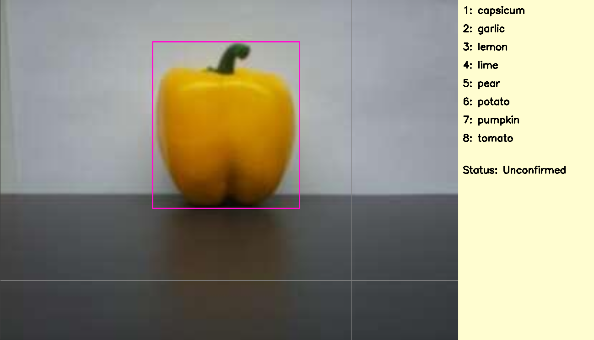

# Auto-Label Toolkit for YOLO Object Detection

Create data in Yolo8 format fast and efficiently using automatic labelling.

<p align="center">
  
</p>

A toolkit for labelling data manually and automatically by training models on smaller datasets.

## Create datasets

Lets say we have a dataset of images. First lets create a smaller dataset of that which we will use to train our starting models.

make sure these datasets are saved into __data/unlabeled__, we will use images of fruit for our example (datasets provided for reference).

<p align="center">
  
</p>

To manually label fruit_small, make sure the right folder is set in config.yaml
```
unlabeled_folder: "fruit_small"
```

Also define the classes and associated bbox color.

Now we are all set to manually label:

```bash
python label_images.py 
```

<p align="center">
  
</p>
<p align="center">
  
</p>


When this is finished, you'll see a folder has been created in data/labeled with the same name as the unlabelled folder
```
...
Saved labels for img_68_png.rf.1043f89c31fa775c9f377f0e8b358544.jpg
Image and labels saved in train folder.
Generated YOLO YAML file at D:\yolo_object_detection\src\..\data\labeled\fruit_small\data.yaml
```

## Train Small Model

Now lets train a model on our small labelled dataset, model name can be specified in config.yaml:
```
model: "steve"
```
Now we train the model:

```bash
python train.py --epochs 20 --batch_size 32
```

```
Epoch    GPU_mem   box_loss   cls_loss   dfl_loss  Instances       Size
1/20       3.2G      1.079      5.052      1.134         89        320: 100%|██████████| 10/10 [
            Class     Images  Instances      Box(P          R      mAP50  mAP50-95): 100%|████████
            all        141        152       0.41      0.431      0.256      0.216

Epoch    GPU_mem   box_loss   cls_loss   dfl_loss  Instances       Size
2/20      3.27G     0.6795      1.945     0.9993         92        320: 100%|██████████| 10/10 [
            Class     Images  Instances      Box(P          R      mAP50  mAP50-95): 100%|████████
            all        141        152      0.584      0.768      0.724      0.628

Epoch    GPU_mem   box_loss   cls_loss   dfl_loss  Instances       Size
3/20      3.22G     0.5641      0.934     0.9246         86        320: 100%|██████████| 10/10 [
            Class     Images  Instances      Box(P          R      mAP50  mAP50-95): 100%|████████
            all        141        152      0.912      0.905      0.973      0.864

...

20 epochs completed in 0.012 hours.
Optimizer stripped from runs\detect\steven\weights\last.pt, 22.5MB
Optimizer stripped from runs\detect\steven\weights\best.pt, 22.5MB

Validating runs\detect\steven\weights\best.pt...
Ultralytics YOLOv8.2.93 🚀 Python-3.12.7 torch-2.4.1+cu124 CUDA:0 (NVIDIA GeForce RTX 4070, 12282MiB)
Model summary (fused): 168 layers, 11,128,680 parameters, 0 gradients, 28.5 GFLOPs
                 Class     Images  Instances      Box(P          R      mAP50  mAP50-95): 100%|████████
                   all        141        152      0.984      0.997      0.992      0.915
              capsicum         18         18      0.984          1      0.995      0.952
                garlic         21         21          1       0.98      0.995      0.927
                 lemon         17         17      0.981          1      0.995      0.905
                  lime         17         17      0.999          1      0.995      0.892
                  pear         23         23      0.949          1      0.973      0.891
                potato         23         23      0.987          1      0.995      0.925
               pumpkin         15         15      0.983          1      0.995      0.917
                tomato         18         18      0.988          1      0.995      0.909
Speed: 0.0ms preprocess, 0.4ms inference, 0.0ms loss, 0.4ms postprocess per image
Results saved to runs\detect\steven
Saved in: runs\detect\steven
```

## Auto Label

Now its time to label the larger dataset with our new model.
First specify the name of the dataset in config.yaml

```
unlabeled_folder: "fruit_large"
```
Now we run auto label:

```bash
python auto_label.py
```

```
...
Saved image to: D:\yolo_object_detection\data\labeled\fruit_large\test\images\Bellpepper4_30cm_png.rf.3479e381d131b92a19ef39247bf7a130.jpg
Saved labels to: D:\yolo_object_detection\data\labeled\fruit_large\test\labels\Bellpepper4_30cm_png.rf.3479e381d131b92a19ef39247bf7a130.txt
...
```

You will notice the a new folder has been created in data/labeled.

To simply view the labeled dataset we can run the following:

```bash
python examine_labeled_data.py
```
<p align="center">
  
</p>

Space bar will cycle through the data. But as expected we have some errors:

<p align="center">
  
</p>

Therefore we should run label_images.py again to confirm / reject images.

```bash
python python label_images.py 
```
Images will be __Confirmed__ by default. 

Cycle through images with __n__.

Press __esc__ to remove any incorrect bounding boxes and then redraw manually.

<p align="center">
  
</p>

## Conclusion

And there we have it. Once this dataset has been fully labelled, we can train another model off the larger dataset. 

Thank you :D